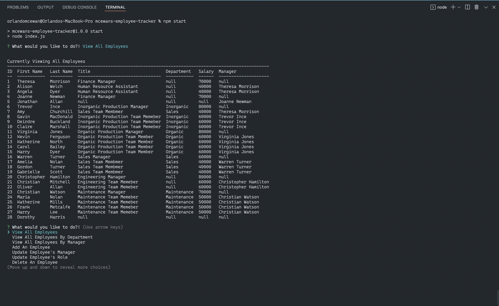

# Employee Tracker

## Table of Contents
 * [Description](#Description)
 * [Installation](#Installation)
 * [Usage](#Usage)
 * [License](#License)
 * [Questions](#Questions)

## Description
This application is am employee tracker that was develop to keep a database for a company. With this tracker you can view all your employees, departments and roles. You can also add employees, departments and roles to your company. There are other options available at your disposal. You can find a basic video demonstration at the following link, https://drive.google.com/file/d/1eG2qf7Z6ZCN_bKO-Nb5zFkzJnipO62lh/view.

## Built With
 * JavaScript
 * ES6
 * Node.js
 * MySQL 2
 * Inquirer
 * Console.Table

## ScreenShot

## Installation
To install this application you need to clone the code base to your system from the repository on github. You will need to have node.js installed to install the dependencies of this application from the node package manager npm. Once node is installed you will run npm install from the command line and all the dependencies will be installed.

## Usage
To use this application once installed, in the command line of your terminal, run the command npm start and application will initialize. You will be given a list of options to choose from and depending on your choice  the app will respond accordingly.

## License
This application is covered under the MIT.
For more details about licensing, use this link: https://choosealicense.com/licenses/mit/.

## Questions
For additional information about the project, please find it at the following www.github.com/omcewan.
Also if you have additional questions please contact me at omcewan18@gmail.com.
